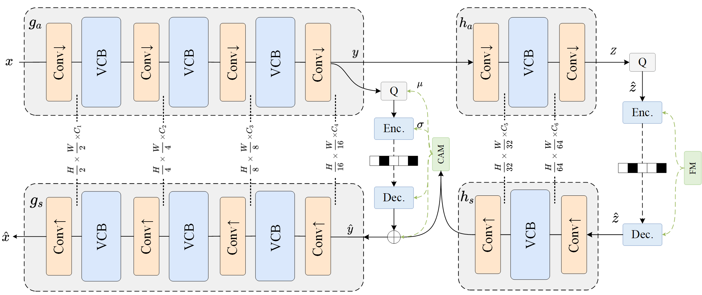
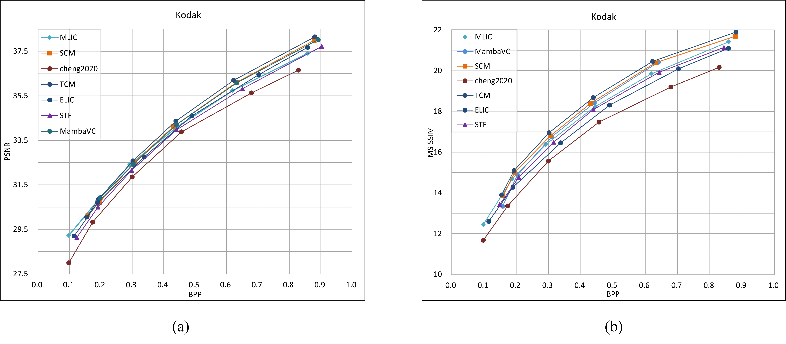
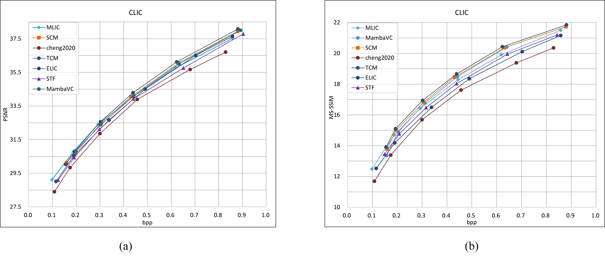

# An Adaptive Hybrid CNN-SSM Model for Efficient Image Compression

# Abstract

Image compression is a critical task in the multimedia domain. With advancements in deep learning, there is a growing demand for neural network-based image compression algorithms. However, existing methods often struggle to balance image quality with compression efficiency. To address this challenge, we propose CSM, an adaptive hybrid image compression framework that integrates Convolutional Neural Networks (CNNs) and State Space Models (SSMs). The CSM framework employs a three-stage design, wherein an Adaptive Channel Partition module dynamically selects channels for local and global feature extraction using CNNs and SSMs, respectively. We introduce the State-space Residual Block (SRB), which integrates state-space models with residual blocks, and a novel channel-wise autoregressive entropy model. Experimental results demonstrate that CSM achieves state-of-the-art compression performance on benchmark datasets like Kodak and CLIC, while significantly reducing model complexity and parameters. Our approach effectively leverages both local and global context information in images, facilitating a thorough extraction of image features and distribution, thereby enhancing compression efficiency. Our code is available at https://github.com/abc123abc804/CSM.

# Architectures

The overall framework.



#  Performance Comparison





# Installation

This codebase was tested with the following environment configurations. It may work with other versions.

- Ubuntu 20.04
- CUDA 12.2
- Python 3.8
- PyTorch 2.2.0 + cu121

From [CompressAI](https://github.com/InterDigitalInc/CompressAI):

```
git clone https://github.com/InterDigitalInc/CompressAI compressai
cd compressai
pip install -U pip && pip install -e .

```


# Training
```
CUDA_VISIBLE_DEVICES='0' python -u ./train.py -d [path of training dataset]  --cuda --N 128 --lambda 0.0025 --epochs 40 --lr_epoch 35 38 --save_path [path for checkpoint] --save --checkpoint [path of the pretrained checkpoint]
```
# Testing
```
python eval.py --checkpoint [path of the pretrained checkpoint] --data [path of testing dataset] --cuda
```

# Cite
```
@inproceedings{CSM,
  author = {Huawang Zhang, Jin Wang, Yunhui Shi},
  title = {An Adaptive Hybrid CNN-SSM Model for Efficient Image Compression},
  booktitle = {Proceedings on The Visual Computer},
  year = {2025}
}
```

